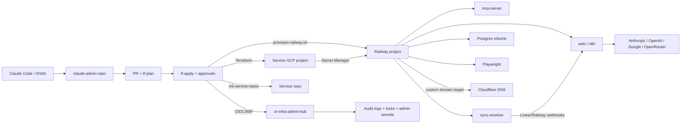

# מחקר מעמיק על המאגר edri2or/claude-admin

## סיכום מנהלים

המאגר `edri2or/claude-admin` הוא בפועל מישור בקרה תשתיתי לשירותים “אוטונומיים” בסגנון Claude: קובץ שירות יחיד תחת `services/*.yaml` מפעיל שרשרת הקמה שמייצרת מאגר שירות חדש, פרויקט GCP ייעודי, פריסת Railway, ו-DNS ב-Cloudflare. מעל זה יושב שרת MCP מנהלי מקומי, תבנית שירות עם n8n, sync-receiver, Playwright ו-MCP service, ומשטר תיעוד ADR שמנסה להפוך כל שינוי תשתיתי להחלטה מתועדת. במילים פשוטות: זה לא “עוד repo של Terraform”, אלא control plane שמנהל הקמה, הרשאות, תיעוד וגבולות פעולה עבור מערכות AI אופרטיביות. fileciteturn16file0 fileciteturn15file0 fileciteturn21file0

מבחינת רלוונטיות למערכות “Claude-like”, המאגר רלוונטי מאוד: הוא משתמש ב-MCP כדי לאפשר לסוכן לגשת לכלי אדמין, מזריק הקשר טופולוגי לסוכנים, מיישם JIT secret fetching, ומפיץ כברירת מחדל מפתחות ל-entity["company","Anthropic","ai company"], ל-entity["company","OpenAI","ai company"], ל-Google ול-OpenRouter לכל שירות חדש. זה משרת היטב שירותי AI מרובי-מודלים, אך גם מגדיל את משטח התקיפה ואת ה-blast radius אם שירות יחיד נפרץ. fileciteturn27file0 fileciteturn26file2 fileciteturn23file2 citeturn3search2turn3search3

התמונה האסטרטגית היא דו-ערכית. בצד החיובי, ניכרת מחשבה עמוקה על least privilege, שימוש ב-WIF במקום מפתחות סטטיים, בידוד state לכל שירות, ביטול גישת אדמין אחרי provisioning, וטיפול זהיר במפתח ה-GitHub App דרך tmpfs. בצד השלילי, קיימים כמה דגלים אדומים: אימות חתימות webhook במצב fail-open אם secret לא קיים; שימוש ב-PAT אדמיניסטרטיבי שעוקף branch protection; היסטוריה עדכנית של direct pushes ל-`main` בלי תיעוד מלא; תלות ב-`npm install` וב-`pip install` בזמן ריצה; והיעדר ראיה ברורה ל-Dependabot/SECURITY policy/CodeQL. fileciteturn27file1 fileciteturn27file2 fileciteturn23file1 fileciteturn29file0 fileciteturn17file1 fileciteturn28file1 fileciteturn17file0 fileciteturn17file1 fileciteturn17file2 citeturn0search2turn4search0turn0search0

מסקנת העל: המאגר הוא בסיס חזק להקמה ותפעול של שירותי AI אוטונומיים, אבל במצבו הנוכחי הוא מתאים יותר ל-“מערכת פנימית מתקדמת של מפעיל יחיד/צוות קטן” מאשר לפלטפורמת production ארגונית בשלה. כדי להגיע לבשלות ארגונית אמיתית, צריך להקשיח branch governance, לסגור fail-open security paths, לייצב supply chain, להוסיף dependency/security scanning, ולמסד inventory, logging, backups ו-rollback מקצה לקצה. מסגרת הבדיקה יושרה גם עם הנחיות המשימה שצורפו לשיחה. fileciteturn0file0

## מה נמצא במאגר ומה המשמעות שלו למערכות Claude-like

ב-README וב-`CLAUDE.md` המאגר מוצג כ-“broker” מרכזי להרשאות ולפרוביז’נינג: שירות מוגדר כ-YAML, ולאחר merge ל-`main` מופעלת שרשרת שמקימה repo חדש, פרויקט GCP, רכיבי Railway ורשומות DNS. ה-README הפשוט מדבר על control plane תשתיתי; `CLAUDE.md` הוא כבר ספר ההפעלה האמיתי של המערכת, עם פירוט workflowים, כלים, contractים תפעוליים, corner-cases ו-failure modes. מבחינה מחקרית, `CLAUDE.md` וה-ADR-ים חשובים יותר מה-README, כי הם משקפים את המודל האמיתי של המערכת כיום. fileciteturn21file0 fileciteturn15file0

המאגר מכיל שרת MCP מנהלי מקומי תחת `mcp-server/`, שרץ ב-stdio בזמן session של Claude Code ומספק כלים לניהול provisioning, בדיקת בריאות פריסה, lockים, DNS, hotfixים וסריקת fleet. זה הופך את המאגר לרלוונטי ישירות לאקוסיסטם Claude/MCP: במקום “סקריפטים עיוורים” בלבד, הסוכן מקבל surface מובנה של כלים. זוהי התאמה חזקה לעקרונות MCP הרשמיים של Anthropic, שבהם MCP מוגדר כפרוטוקול אחיד לחיבור מודלים אל כלים ומקורות הקשר. fileciteturn16file0 fileciteturn16file1 fileciteturn15file0 citeturn3search3turn3search6

תבנית השירות (`service-template/`) נועדה להעמיד במהירות “שירות AI אוטונומי” עם מבנה קבוע: קבצי CLAUDE, hook ל-session start, policy, workflows, sync-receiver, Playwright, ופרויקט Python/TypeScript. ה-hook מדפיס לסוכן context טופולוגי, מייצא רק AI keys, ודוחף את שאר הסודות למסלול JIT דרך MCP. זהו דפוס שימושי מאוד למניעת “הזיות תשתית” של סוכן ולצמצום חשיפה של tokens חזקים. fileciteturn26file2 fileciteturn27file0 fileciteturn26file1 fileciteturn11file0

עם זאת, יש כאן גם trade-off מהותי. ADR-0041 מעגן מודל fire-and-forget: אחרי provisioning והסרת `services/{name}.yaml`, המאגר לא “מחזיק” עוד יחסי ניהול מלאים עם השירות. זו בחירה נכונה כדי למנוע split-brain בין מערכת אדמין מרכזית לבין סוכן מקומי של השירות, אבל היא גם מחלישה inventory, drift awareness, ויכולת governance מרכזית לאורך זמן. זהו יתרון טקטי לאוטונומיה; זו חולשה אסטרטגית לתפעול ארגוני, compliance ו-asset management. fileciteturn15file2 fileciteturn29file0 fileciteturn16file1

## קבצים מרכזיים, ארכיטקטורה, תלותים והגדרות

הטבלה הבאה מרכזת את הקבצים החשובים ביותר שנבדקו, תפקידם ורמת הקריטיות שלהם:

| קובץ | תכלית | קריטיות | הערה אנליטית |
|---|---|---|---|
| `README.md` | תיאור על המערכת וה-flow הבסיסי להוספת שירות | בינונית | טוב ככניסה מהירה, אך מפשט יתר על המידה וחלק מהמידע בו מיושן ביחס לקוד בפועל. fileciteturn21file0 |
| `CLAUDE.md` | ספר הפעלה חי: workflows, כלים, קונבנציות, failure modes | גבוהה מאוד | זהו ה-source of truth התפעולי הטוב ביותר שנבדק. fileciteturn15file0 |
| `docs/bootstrap.md` | הקמה חד-פעמית של סביבת האדמין | גבוהה | מספק את ה-runbook הטוב ביותר ל-bootstrap, כולל GCP, GitHub App, Cloudflare ו-Railway. fileciteturn29file0 |
| `terraform/gcp.tf` | פרויקטי GCP, Secret Manager, WIF, IAM | גבוהה מאוד | לב המודל האבטחתי וההרשאות. fileciteturn23file2 |
| `terraform/github.tf` | יצירת repos, branch protection, secrets | גבוהה מאוד | כולל גם branch protection וגם הזרקת secrets ל-repo החדש. fileciteturn23file1 |
| `terraform/backend.tf` + `terraform/locals.tf` | בידוד state ו-scope לשירות יחיד | גבוהה | מפחית blast radius ומונע state שיתופי. fileciteturn23file0 fileciteturn22file2 |
| `.github/workflows/tf-apply.yml` | orchestration של apply, import, provisioning ו-cleanup | גבוהה מאוד | זהו ה-pipeline הייצורי בפועל. fileciteturn29file0 |
| `scripts/provision-railway.sh` | הקמת Railway/Cloudflare, secrets והזרקת topology | גבוהה מאוד | זהו הרכיב הכי טעון תפעולית והכי “מסוכן” במאגר. fileciteturn28file0 |
| `mcp-server/src/index.ts` | שרת MCP אדמיניסטרטיבי מקומי | גבוהה | נקודת החיבור הישירה לעולם Claude/MCP. fileciteturn13file2 |
| `service-template/sync-receiver/src/index.ts` | webhook receiver ל-Linear/Railway עם forward ל-n8n | גבוהה | חשוב מאוד לאוטונומיה ול-monitoring, אך כולל fail-open בעייתי. fileciteturn17file1 |
| `service-template/.github/workflows/ci.yml` | CI בסיסי לשירותים החדשים | בינונית-גבוהה | מגדיר baseline טוב, אך לא מחליף security scanning מלא. fileciteturn11file1 |
| `.github/workflows/pr-autofix.yml` + `scripts/pr-autofix.py` | לולאת תיקון CI ו-post-merge monitoring | גבוהה | אוטומציה מתקדמת מאוד, אבל עם סיכוני governance ו-rollback. fileciteturn16file2 fileciteturn16file1 |

ארכיטקטונית, הקו המנחה של המאגר הוא “שירות אחד בכל ריצה”: `TF_VAR_service_name` מחייב scope לשירות יחיד, ה-state backend ב-GCS מקבל prefix ייעודי לכל שירות, וה-`locals` ב-Terraform טוענים בדיוק YAML אחד. זהו דפוס טוב מאוד להפחתת blast radius, ומבחינת תפעול של מערכות AI אוטונומיות זו אחת ההחלטות החזקות ביותר במאגר. fileciteturn22file2 fileciteturn23file0

סט התלויות בתשתית הוא מינימלי וברור: Terraform עם providers של GitHub, Google ו-Cloudflare; Railway מנוהל לא דרך provider אלא דרך GraphQL/script; ב-MCP server יש `@google-cloud/secret-manager`, `@modelcontextprotocol/sdk` ו-`zod`; ב-sync-receiver יש Express; ובשירותי Playwright יש `@playwright/test`. fileciteturn22file0 fileciteturn24file0 fileciteturn25file0 fileciteturn17file0 fileciteturn17file2

תצורת השירות נתונה ב-YAML פשוט יחסית: `name`, `description`, `subdomain`, הגדרות `github`, רשימת `gcp.secrets`, ו-`railway.sync_receiver`. זהו מודל נוח מאוד לאופרציה מבוססת YAML, אך הוא כיום חסר ולידציה קשיחה. בפרט, נראה שהקוד מניח באופן עמוק prefix קבוע `or-` עבור GCP, אך אינו אוכף מספיק שהשם ב-YAML לא יכיל אותו כבר. היסטוריית PRs מראה שאכן נוצרו מצבים של `or-or-project-life-20`, כלומר schema validation עדיין לא חזק מספיק. fileciteturn10file0 fileciteturn23file2 fileciteturn19file1

דוגמת הקונפיגורציה הטובה ביותר לשירות חדש נראית כך:

```yaml
name: my-service
description: "What it does"
subdomain: my-service
github:
  visibility: private
gcp:
  secrets:
    - DATABASE_URL
    - API_KEY
railway:
  sync_receiver: false
```

הדוגמה נגזרת ישירות מה-README ומה-template של `services/_example.yaml`. בפועל, מומלץ להוסיף ולידציה מפורשת ש-`name` לא מתחיל ב-`or-`, כדי למנוע יצירת `or-or-*`. fileciteturn21file0 fileciteturn10file0 fileciteturn23file2

מצאתי גם drift תיעודי שראוי לציון. ה-README עדיין מתאר את Cloudflare כמשאב Terraform, בעוד הקוד בפועל מעביר את DNS ל-`provision-railway.sh`; ובאותו README יש תיאור פשוט יותר של GitHub/GCP מאשר מה שקורה בפועל ב-ADR-ים וב-workflows. לכן, בכל סתירה בין README לבין `CLAUDE.md`/Terraform/workflows, יש להעדיף את הקוד וה-ADR-ים. fileciteturn21file0 fileciteturn24file1 fileciteturn15file0

## פעילות GitHub, workflows וממשל שינויים

מבחינת CI/CD ו-governance, זוהו במפורש ה-workflows הבאים: `tf-plan.yml`, `tf-apply.yml`, `pr-autofix.yml`, `docs-check.yml`, `docs-audit.yml`, `n8n-setup.yml`, `init-template.yml`, ובנוסף workflowים של skill distribution/sync שנוספו לאחרונה. הסט הזה מלמד שהמאגר אינו רק תשתית provisioning, אלא גם מרכז אוטומציה רחב יותר. fileciteturn15file0 fileciteturn29file0 fileciteturn16file2 fileciteturn28file1 fileciteturn28file0 fileciteturn28file2

המצב העדכני שמצאתי ב-repo מצביע על ארבעה issues פתוחים רצופים, כולם מסוג `docs-debt`, שנפתחו אוטומטית בגלל שינויים תשתיתיים ישירים ב-`main` ללא עדכון `docs/adr/` או `CLAUDE.md`. שלושה מהם עוסקים בשינויי workflowים (`skill-contribute.yml`, `skill-sync.yml`), ורביעי עוסק ב-`services/project-life-17.yaml`. זהו אות ברור לכך שהבקרה הקיימת על תיעוד קיימת, אבל בפועל היא post-hoc ולא מונעת direct push אדמיניסטרטיבי. fileciteturn17file0 fileciteturn17file1 fileciteturn17file2 fileciteturn18file0 fileciteturn28file1

ה-PR הפתוח הבולט שמצאתי הוא PR #180, שמפיץ קובץ `.claude/commands/automation-research.md` מ-repo אחר אל המאגר הנוכחי. עצם זה שהטקסט של ה-PR אומר “Direct push blocked by branch protection — opening PR instead” מלמד שהגנת branch פעילה, אבל העובדה שיש גם issues על undocumented direct pushes מלמדת שבפועל יש מסלול עוקף-בדיקות עבור actors מסוימים. fileciteturn19file0 fileciteturn17file0

PRים וקומיטים היסטוריים שנבדקו מלמדים הרבה על מוקדי הסיכון של המערכת. PR #171 וקומיטים `828b210` ו-`9968e0f` תיקנו שרשרת שבר סביב soft-delete של פרויקט GCP, תזמון import, וניתוק billing לאחר undelete; קומיט `0b10388` הוסיף מחדש YAML לשירות כדי לשחזר IAM ל-Secret Manager; ו-PR #174 הדגים בפועל תכנית Terraform שבה שם שירות בפורמט `or-project-life-20` גרם ליצירת מזהי GCP בפורמט `or-or-project-life-20`. זו אינדיקציה היסטורית ברורה לכך שהמערכת עדיין רגישה לשגיאות naming ול-state recovery. fileciteturn19file2 fileciteturn24file0 fileciteturn24file1 fileciteturn24file2 fileciteturn19file1

מבחינת “contributors”, הזהויות הפעילות שנצפו ישירות הן `edri2or-commits`, `or-infra-admin[bot]`, `github-actions[bot]`, וכן co-authors בשם “Claude” ו-“PR Autofix” בהיסטוריית קומיטים. אין בכך פסול, אבל זה מדגיש שהמאגר כבר מנוהל בפועל על ידי צירוף של botים ואוטומציות, ולכן דרישות auditability ו-identity separation כאן קריטיות במיוחד. fileciteturn23file0 fileciteturn24file0 fileciteturn19file1 fileciteturn17file0

לא הצלחתי לאמת מתוך הקבצים שנבדקו קובץ `LICENSE`, קובץ `SECURITY.md`, או תצורת Dependabot/CodeQL מפורשת. לכן, מבחינת רישוי ומנגנוני advisory מובנים של GitHub, המסקנה השמרנית היא שהמצב אינו מתועד דיו במסמכים שנבדקו. המשמעות המעשית: לא הייתי מסתמך על המאגר הזה כמוצר שניתן להפצה חיצונית בלי השלמה של שכבת policy ו-security metadata. fileciteturn15file0 citeturn4search0turn4search1

## ניתוח אבטחה

הבסיס האבטחתי של המאגר טוב למדי. הוא נשען על OIDC/WIF כדי להימנע ממפתחות GCP סטטיים ב-GitHub, מגביל את ה-WIF לפי attribute condition לריפו/ארגון, מפצל שירותים לפרויקטי GCP נפרדים, יוצר service account ייעודי לכל שירות, ומרכז את רוב הסודות ב-`or-infra-admin-hub` תחת Secret Manager. זה תואם היטב להמלצות הרשמיות של GitHub ושל Google להשתמש ב-OIDC/WIF וב-short-lived cloud credentials במקום long-lived secrets, ולהגביל trust conditions כאשר ה-IdP הוא multi-tenant כמו GitHub. fileciteturn29file0 fileciteturn23file2 fileciteturn27file1 citeturn1search1turn1search3turn0search1turn0search3

בנוסף, הטיפול במפתח ה-PEM של GitHub App הוא אחד ההיבטים המרשימים במאגר. ADR-0017 וה-workflow של `tf-apply` מעבירים את המפתח דרך `/dev/shm` ולא דרך `GITHUB_ENV`, מוחקים אותו מוקדם, ומייצרים token קצר-חיים של GitHub App. זהו pattern נכון בהרבה לעומת PAT קבוע או env var קבוע. גם GitHub itself מדגישה ש-installation tokens של GitHub App הם scoped ו-expire after 1 hour. fileciteturn27file2 fileciteturn29file0 citeturn1search0turn1search6

לצד זה, יש כמה ממצאים חמורים יותר שדורשים טיפול:

| ממצא | חומרה | למה זה חשוב | ראיות |
|---|---|---|---|
| אימות webhook במצב fail-open | גבוהה | ב-`sync-receiver`, אם `LINEAR_WEBHOOK_SECRET` או `RAILWAY_WEBHOOK_SECRET` לא מוגדרים, הבקשה מתקבלת כתקינה במקום להידחות. זה מאפשר spoofing של events במקרה של misconfiguration. | fileciteturn17file1 |
| PAT אדמיניסטרטיבי לעקיפת branch protection | גבוהה | Job ה-cleanup משתמש ב-`GH_TOKEN` כדי למחוק קבצים דרך Contents API כי `GITHUB_TOKEN` לא יכול לעקוף status checks; במקביל branch protection מוגדר עם `enforce_admins=false`. בפועל נמצאו issues על direct pushes לא מתועדים. | fileciteturn29file0 fileciteturn23file1 fileciteturn17file0 fileciteturn17file1 fileciteturn17file2 fileciteturn18file0 |
| Supply-chain drift ב-CI וב-build | גבוהה-בינונית | Dockerfiles ותלויות משתמשים ב-tags/version ranges ולא ב-digests/SHAs; workflows משתמשים ב-actions לפי tag major; `provision-railway.sh` מבצע `pip install pyyaml -q` בזמן ריצה; במספר Dockerfiles מופיע `npm install` במקום `npm ci`. | fileciteturn28file0 fileciteturn11file1 fileciteturn11file2 fileciteturn12file0 fileciteturn12file1 fileciteturn25file0 fileciteturn25file1 citeturn0search2 |
| הפצת API keys משותפים לכל שירות | גבוהה-בינונית | `ANTHROPIC_API_KEY`, `OPENAI_API_KEY`, `GOOGLE_API_KEY`, `OPENROUTER_API_KEY` מוזרקים אוטומטית לכל פרויקט שירות. זה נוח, אבל שירות פרוץ אחד יכול לדלוף מפתחות shared ולפגוע בכל המערכת. | fileciteturn23file2 fileciteturn22file1 citeturn0search0 |
| שימוש נרחב ב-env vars לסודות runtime | בינונית | Google ממליצה להעדיף גישה דרך Secret Manager API ולהימנע ככל האפשר מחשיפת סודות בקבצים וב-env vars, בעוד Railway עצמו מזריק vars לכל build/deploy/runtime shell. המאגר אמנם מנסה לצמצם זאת עבור הטוקנים החזקים, אך עדיין מסתמך heavily על env injection לשירותים. | fileciteturn26file2 fileciteturn28file0 citeturn0search0turn5search1 |
| היעדר ראיה ברורה ל-Dependabot/security policy | בינונית | בלי Dependabot/SECURITY/CodeQL קשה לטעון לניהול פגיעויות שיטתי. GitHub ממליצה להפעיל Dependabot alerts מכיוון שהם בודקים default branch מול GitHub Advisory DB. | citeturn4search0turn4search1 |

קטע הקוד הבא הוא הדוגמה הבעייתית ביותר מבחינה אבטחתית:

```ts
function verifyRailwaySignature(rawBody: Buffer, signature: string): boolean {
  if (!RAILWAY_WEBHOOK_SECRET) {
    console.warn('[warn] RAILWAY_WEBHOOK_SECRET not set — skipping Railway signature check');
    return true;
  }
  // ...
}
```

זהו fail-open קלאסי. במערכת production, אם secret חסר — הבקשה צריכה להידחות, וה-service צריך להחזיר שגיאה ברורה. fileciteturn17file1

מנגד, יש גם patterns טובים שכדאי לשמר. ה-repo מבטל access של `claude-admin-sa` לפרויקט השירות אחרי provisioning; משתמש ב-GitHub App במקום PAT עבור חלקים משמעותיים; ומטפל ב-secret PEM דרך tmpfs. אלה patterns שמתיישרים היטב עם best practices של least privilege, short-lived credentials ו-secret minimization. fileciteturn29file0 fileciteturn27file1 fileciteturn27file2 citeturn0search1turn1search0turn0search0

## היבטים תפעוליים וארכיטקטורת פריסה מומלצת

תפעולית, המאגר בנוי נכון סביב עקרון blast radius מינימלי. state מבודד לכל שירות, apply מוגבל לשירות אחד, ותהליך ה-provisioning נפרד לשלבי Terraform, Railway ו-cleanup. זה משרת היטב scale אופרטיבי של “הרבה שירותים קטנים” ומקטין סיכון של apply רוחבי לא מכוון. בנוסף, ה-`guard` job ב-`tf-apply.yml` מונע false triggers מלהגיע לשלב approval. fileciteturn22file2 fileciteturn23file0 fileciteturn29file0

מבחינת monitoring, יש כאן תערובת של polling, passive observation ו-webhook-driven reactions. ADR-0038 מעביר את המערכת למעקב event-driven דרך Railway webhooks ל-sync-receiver, בעוד `scan_fleet_telemetry()` ב-admin MCP הוא passive/read-only. זה מודל נכון יותר מ-cron polling בלבד, אבל עדיין לא מצאתי במאגר תיאור של stack מרכזי ל-logs, metrics או alert routing ארגוני. Railway עצמה מדגישה ש-healthchecks משמשים לאפס-דאונטיים בפריסה ואינם continuous monitoring לאחר העלייה לאוויר. לכן, למערכת יש observability פונקציונלית, אבל לא observability ארגונית מלאה. fileciteturn15file1 fileciteturn15file0 fileciteturn17file1 citeturn3search0

מבחינת backups ו-recovery, המצב חלקי. יש bucket ייעודי ל-Terraform state, ו-Railway מציעה volume backups עם schedules ו-restore flow, אבל המאגר עצמו אינו מגדיר policy תשתיתי מחייב לגיבויים של Postgres/n8n volumes, ולא מצאתי runbook סדור של restore drill לשירותים המופקים ממנו. זה פער תפעולי מהותי. fileciteturn29file0 citeturn5search0

מבחינת upgrade paths, יש כאן trade-off ברור: ה-service template מתעדכן כל הזמן, אך ADR-0041 קובע במפורש שאין “recall” לשירותים שכבר provisioned. התוצאה היא שתיקוני template עתידיים מיטיבים עם שירותים חדשים בלבד, בעוד קיימים נשארים autonomous. זה מצמצם split-brain, אבל גם משאיר debt של compatibility ו-upgrade orchestration שאינו נפתר מרכזית. fileciteturn15file2 fileciteturn23file0 fileciteturn23file1 fileciteturn23file2

הארכיטקטורה המומלצת לפריסה והקשחה היא:



הדיאגרמה משקפת נאמנה את המודל הקיים, אך בגרסה המוקשחת שאני ממליץ עליה יש להוסיף גם: סביבת staging ב-Railway, Audit Logs ב-GCP עבור Secret Manager, גיבויי Railway מתוזמנים, וייצוא inventory מרכזי לאחר cleanup. ההמלצות הללו נשענות גם על ה-repo וגם על התיעוד הרשמי של Google, GitHub ו-Railway. fileciteturn29file0 fileciteturn28file0 fileciteturn23file2 citeturn0search0turn1search3turn5search0turn5search7

## צ'קליסט הקמה, בדיקות, רולבק והמלצות

### צ'קליסט הקמה ופריסה בפועל

להקמה ראשונית של סביבת האדמין, המאגר דורש גישת Owner ב-GCP organization, ב-GitHub organization, ב-Cloudflare וב-Railway. ה-bootstrap guide מגדיר עשרה שלבים: הפעלת APIs ב-`or-infra-admin-hub`, הקמת `claude-admin-sa`, יצירת bucket ל-state, הקמת WIF, יצירת GitHub App, איסוף Cloudflare zone/token, יצירת Railway token, טעינת כלל הסודות ל-GCP Secret Manager, הוספת שני bootstrap secrets בלבד ל-GitHub Environment `admin`, והרצת `init-template.yml`. fileciteturn29file0

פקודות bootstrap הקריטיות הן:

```bash
gcloud config set project or-infra-admin-hub

gcloud services enable \
  cloudresourcemanager.googleapis.com \
  iam.googleapis.com \
  secretmanager.googleapis.com \
  storage.googleapis.com \
  iamcredentials.googleapis.com \
  sts.googleapis.com

gcloud iam service-accounts create claude-admin-sa \
  --project=or-infra-admin-hub \
  --display-name="Claude Admin SA"

gcloud storage buckets create gs://or-infra-terraform-state \
  --project=or-infra-admin-hub \
  --location=us-central1 \
  --uniform-bucket-level-access
```

זהו ה-gravity center של המערכת: בלי SA, בלי state bucket ובלי WIF, שום workflow לא יוכל לעבוד באופן בטוח. fileciteturn29file0

לפריסה של שירות חדש, מסלול העבודה הוא פשוט יחסית: ליצור YAML חדש דרך `./scripts/new-service.sh` או ידנית, לפתוח PR, להמתין ל-`terraform plan`, למזג, ולאשר את סביבת `admin` כשנדרש. ב-runbook המקומי של המאגר זמינות גם פקודות manual ל-`terraform init/plan/apply`, ולפעמי break-glass workflow ייעודי של `n8n-setup.yml` אם `N8N_API_KEY` חסר. fileciteturn21file0 fileciteturn29file0 fileciteturn28file0

### משתני סביבה וסודות שיש להכיר

ברמת admin/GitHub environment, יש בדיוק שני secrets bootstrap: `GCP_WORKLOAD_IDENTITY_PROVIDER` ו-`GCP_SERVICE_ACCOUNT`. שאר הסודות נשלפים מ-`or-infra-admin-hub`: `GH_APP_ID`, `GH_APP_PRIVATE_KEY`, `GH_TOKEN`, `CLOUDFLARE_API_TOKEN`, `CLOUDFLARE_ZONE_ID`, `RAILWAY_TOKEN`, `GCP_BILLING_ACCOUNT`, ומפתחות ה-AI. זו בחירה נכונה עקרונית, כי היא ממזערת סודות ארוכי-חיים ב-GitHub. fileciteturn29file0 fileciteturn27file1

ברמת runtime/service, מה שמצאתי בוודאות הוא: `sync-receiver` מאזין כברירת מחדל על `PORT||3002`; Railway מצפה שהשירות יאזין על `PORT` עבור healthchecks; Postgres ניגש דרך TCP proxy על 5432; ואילו לשירותי `web`, `mcp-server` ו-`playwright` לא מצאתי בפלחי הקבצים שנבדקו תיעוד מלא ואחיד של פורט ריצה סופי, ולכן יש להתייחס אליהם כמוגדרים ב-Railway/Dockerfile אך לא מתועדים דיים במסמכים. fileciteturn17file1 citeturn3search0

### בדיקות וולידציה מומלצות

מכיוון שהמאגר מטפל גם בתשתית וגם באוטונומיה של סוכנים, הייתי מריץ מסלול validation בארבע שכבות. השכבה הראשונה היא תשתיתית: `terraform plan` חייב להיות deterministic; import חייב להצליח או להסתיים ב-no-opים סבירים; ו-`tf-apply` חייב לעבור גם ב-rerun אחרי soft-delete/billing detach. השכבה השנייה היא פריסת Railway: כל service standard נוצר, custom domain מקבל CNAME ו-TXT, ו-`/health` מחזיר 200. השכבה השלישית היא אבטחתית: webhook signatures נכשלות כאשר secret חסר או חתימה שגויה; WIF עובד רק מול ה-repo המיועד; ו-secrets לא נזילים ללוגים. השכבה הרביעית היא governance: docs-check, docs-audit, policy-check וה-flow של PR autofix אינם יוצרים bypass לא מתועד. fileciteturn29file0 fileciteturn17file1 fileciteturn15file0 citeturn0search2turn0search1

בפרקטיקה, הייתי מוסיף שלוש בדיקות שלא נראות לי מבוססות מספיק כיום. הראשונה: test שלילי מפורש ל-webhook verification כדי לוודא fail-closed. השנייה: restore drill רבעוני ל-volume backup של Railway עבור service מייצג. השלישית: validation schema ל-`services/*.yaml` שמכשיל PR אם `name` מתחיל ב-`or-` או אם התכנית מייצרת `or-or-*`. זהו שילוב של security, operability ו-governance. fileciteturn17file1 fileciteturn19file1 citeturn5search0

### תכנית רולבק

למאגר כבר יש מנגנון rollback חלקי: אם `pr-autofix` מזהה failure לא-בר-תיקון, הוא מוחק את פרויקט ה-GCP, וה-rerun של `tf-apply` יודע לשחזר soft-deleted project ולהחזיר billing לפני import. אבל ADR ה-handshake-and-rollback אומר במפורש ש-Railway projects ו-Cloudflare DNS אינם נמחקים אוטומטית ב-rollback וזקוקים לניקוי ידני. לכן הרולבק הקיים הוא טוב לשיקום ה-GCP namespace, אך אינו end-to-end rollback מלא. fileciteturn16file0 fileciteturn24file0 fileciteturn24file1

תכנית רולבק מעשית שאני ממליץ עליה היא זו: לקבע קודם את `service_name` וה-`subdomain`; אם failure קרה לפני cleanup, לבצע rerun ל-`tf-apply`/`railway-provision`; אם בוצע rollback דרך מחיקת פרויקט GCP, לבצע התאוששות נקייה או ניקוי ידני של Railway/Cloudflare; אם יש volume data, לשחזר מה-backup העדכני של Railway; ואז להריץ verification מלא של DNS, healthchecks, WIF access ו-secret availability. בלי שלב ה-restore drill, הרולבק נשאר תאורטי בלבד. fileciteturn16file0 fileciteturn29file0 citeturn5search0turn3search0

### המלצות ממוקדות ומתועדפות

| אופק | המלצה | מאמץ | נימוק |
|---|---|---|---|
| קצר | להפוך את אימות החתימות ב-sync-receiver ל-fail-closed | נמוך | זהו תיקון ממוקד עם השפעה גבוהה על spoofing risk. fileciteturn17file1 |
| קצר | להוסיף schema validation ל-`services/*.yaml` ולאסור `name` עם `or-` | נמוך | מונע `or-or-*` ומיישר naming עם Terraform. fileciteturn23file2 fileciteturn19file1 |
| קצר | לעדכן README/דוגמאות כדי ליישר אותן לקוד בפועל | נמוך | כרגע יש drift תיעודי שעלול להטעות operatorים וסוכנים. fileciteturn21file0 fileciteturn24file1 |
| קצר | להפעיל Dependabot alerts ולהוסיף `SECURITY.md` | נמוך-בינוני | זה ייתן visibility שוטף על dependency vulnerabilities ו-channel disclosure בסיסי. citeturn4search0turn4search1 |
| בינוני | לעבור מ-`npm install` ל-`npm ci`, לקבע images ב-digest, ולקבע Actions ב-SHA מלא | בינוני | זהו hardening supply-chain בסיסי ש-GitHub ממליצה עליו במפורש. fileciteturn28file0 fileciteturn29file0 citeturn0search2 |
| בינוני | לצמצם/להחליף את `GH_TOKEN` האדמיניסטרטיבי ולעדכן branch protection כך שאדמינים לא יעברו checks ללא policy ברור | בינוני-גבוה | זהו מוקד הסיכון הגדול ביותר ב-governance. fileciteturn29file0 fileciteturn23file1 |
| בינוני | להפעיל Data Access Logs ל-Secret Manager ולהקשיח secret-level IAM ב-admin hub | בינוני | aligns with Google best practices ומצמצם blast radius. fileciteturn27file1 citeturn0search0 |
| בינוני | לקבוע policy מחייב לגיבויי Railway volumes ולבצע restore drill תקופתי | בינוני | כיום זה gap תפעולי משמעותי. citeturn5search0 |
| ארוך | להוסיף inventory מרכזי יציב אחרי cleanup | גבוה | ה-fire-and-forget טוב לאוטונומיה, אך יקר ל-governance ול-audit. fileciteturn15file2 |
| ארוך | להפריד staging/production ב-Railway environments ולהוסיף smoke/canary post-deploy | גבוה | יפחית סיכון בפריסות AI services עם state ונפח תפעולי. citeturn5search7turn3search0 |

### שאלות פתוחות ומגבלות

לא הצלחתי לאמת ישירות לשונית Security Advisories של ה-repo או קובץ רישיון מפורש מתוך הקבצים שנבדקו, ולכן איני טוען לקיום או להיעדר advisory פתוחים ברמת GitHub UI. בנוסף, נמצאו סתירות בין README לבין הקוד, ולכן בכל נקודת קונפליקט הסתמכתי על `CLAUDE.md`, ה-ADR-ים, ה-workflows וקבצי Terraform/סקריפטים כ-Source of Truth. לבסוף, עבור חלק מהרכיבים ב-service template לא נמצא תיעוד מלא של פורטים ו-runtime contracts בכל הקבצים שנבדקו, ולכן סימנתי אותם כלא-מוגדרים במפורש במקום לנחש. fileciteturn15file0 fileciteturn21file0