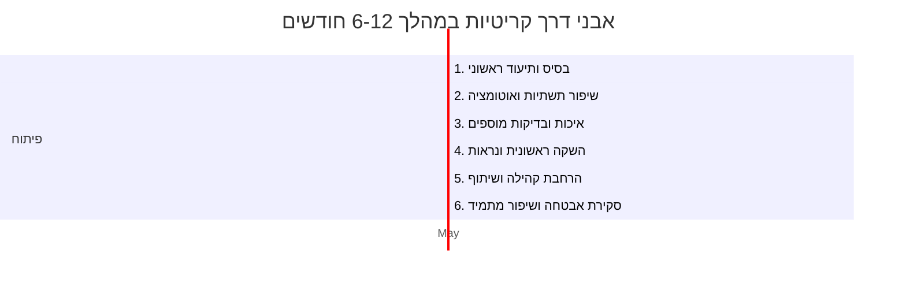

# תקציר מנהלים  
מאגר **project-life-130** הוא *כתבנית לפיתוח מערכת אוטונומית בענן* שמיישמת מנגנון **Policy-as-Code** לאכיפת תיעוד בפרויקטים בהם פועלים סוכנים אוטונומיים (למשל Claude Code). מטרתו למנוע תופעת *"סטיית תיעוד"*: כאשר הקוד משתנה אך המסמכים אינם מתעדכנים, מה שגורם לסתירות ושגיאות רישוי【5†L14-L21】【7†L10-L18】. הפתרון משתמש בתהליך בדיקת CI המחייב (blocking gate) את כללי התיעוד: כל שינוי בקוד בחלק מסוים ידרוש עדכון במסמך תיעודי מתאים. המבנה המרכזי כולל ארבע שכבות אכיפה: עדכון `CLAUDE.md` כשמשנים לוגיקה של הסוכן, יצירת ADR חדש בשינוי תשתית או תלות, הוספת יומן ב-`JOURNEY.md` בכל שינוי קוד, ובניית בדיקת checksum עתידית【5†L16-L21】【8†L140-L148】.  

המאגר כתוב בשפות TypeScript (לוגיקת הסוכן), Python (סקריפטים ו-bash בעזרתו), וכולל גם Terraform עבור פריסת תשתית ב-GCP. הוא משלב טכנולוגיות רבות: *Railway* לאירוח השירותים, *GitHub* לניהול קוד ו-CI, *N8N* לאוטומציות וזרימת עבודה, *Cloudflare* לניהול DNS/SSL, *GCP Secret Manager + Workload Identity* לאחסון סודות ול-GCP IAM, *OpenRouter* (ניתוב מודלים) ו-*Telegram* לממשק המפעיל【7†L51-L60】. כל הכלים הללו מתואמים דרך התיעוד והקוד כך שהתהליך האוטומטי יתנהל בסינכרון מלא. הפרויקט מוגדר כתבנית ב-GitHub, עם הוראות לשימוש בפקודות ובסקריפט שמחליפים את השם במקומות הרלוונטיים【5†L32-L40】【51†L42-L50】. בסופו של דבר ה-**CI/CD** מוודא שכל שינוי עובר את בדיקת תיעוד מוקפדת ב-`.github/workflows/documentation-enforcement.yml`【8†L140-L148】.  

**ממצאי המבט הכולל**: הטכנולוגיה והארכיטקטורה מפותחים היטב ומגובים בתיעוד נרחב (CLAUDE.md מפרט קונטקסט של המערכת ונהלים【7†L10-L18】, וה-README מסביר את הבעיה והפתרון). הקוד עצמו נקי ומשתמש בטכנולוגיות מודרניות (TypeScript עם בדיקות Vitest【33†L27-L35】, Python 3). עם זאת זוהו פערים בתיעוד הרשמיים: חסרים קבצי LICENSE, CONTRIBUTING.md ותבניות נושאים (Issue Templates) להסדרת תרומה וקהילה. כמו כן קיימת תלות חלקית ב-PAT או שירותים חיצוניים (למשל GitHub PAT ל-N8N) שראוי לבדוק את המיגרציה ל-GitHub App או OIDC.  

# מבנה ותיעוד המאגר【7†L69-L77】【5†L16-L21】  
המאגר מאורגן כך שהקבצים והספריות העיקריים ממופים ל-4 שכבות התיעוד. למשל, CLAUDE.md הוא "קובץ הקשר" (agent context) המפרט את ייעוד המערכת, פרטי המפעיל והסוכן, ושכבות התיעוד【7†L10-L18】【7†L69-L77】. README.md ממקם את המאגר כ"תבנית לפעולת Policy-as-Code על *התיעוד*" ומפרט את הלוגיקה המרכזית (טבלה של 4 השכבות)【5†L16-L21】. מבנה התיקיות מתואר גם ב-CLAUDE.md (ראה צירוע לדוגמא מטה【7†L69-L77】):  

```text
project-life-130/
├── CLAUDE.md                 # Layer 1: Agent context (קובץ זה)
├── state.json                # מצב נוכחי (עקב ADR 0030)
├── state.schema.json         # סכמת JSON ל-state.json
├── JOURNEY.md                # Layer 3: יומן רבעוני חם (הרבעון הנוכחי)
├── HANDOFF.md                # Stub ל-state.json
├── src/agent/                # קוד הסוכן (Skills router)
├── docs/
│   ├── adr/                  # Layer 2: Architecture Decision Records
│   ├── archive/              # יומני רבעונים קודמים (cold storage)
│   └── system/               # מסמכי מערכת (PERSONAS, PLATFORMS, BUILD-STAGES)
├── policy/                   # RegO/Opa מדיניות לתיעוד (claude, journey, adr, state, skill)
├── scripts/                  # סקריפטים עזר ל-CI (check_policies, rotate-journey, וכו׳)
├── workflows/n8n/            # קבצי JSON לאוטומציות N8N (לצורך ADR 0035)
├── .claude/                  # קונפיגורציית CLAUDE Code (פקודות, תבניות, הגדרות)
└── .github/workflows/        # תהליכי CI כולל documentation-enforcement.yml
```  
מתוך CLAUDE.md【7†L69-L77】.  

#### דוגמאות לכללי האכיפה  
ב-CLAUDE.md מופיעים כללים נוקשים לחסום מיזוג PR אם הם אינם עומדים בתיעוד המעודכן【8†L142-L150】. לדוגמה: *"לעולם לא למזג PR שמשנה `src/agent/` ללא עדכון המתאים בקובץ זה"*【8†L142-L150】, ואי-אפשר למזג שינוי בקוד (src/) בלי הוספת יומן ב-`JOURNEY.md`. כלל דומה של ADR קובע כי שינוי בתשתית או תלות דורש ADR חדש ב-`docs/adr/`. הכללים מוודאים שסוכני ההדרכה (Claude) תמיד מפעילים את המסמכים כ"בסיס זיכרון"【7†L10-L18】【8†L142-L150】. 

# טכנולוגיות, תלויות ואיכות הקוד【11†L9-L17】【33†L27-L35】  
הקוד בנוי בשפת TypeScript מודרנית, ללא שימוש חיצוני בספריות NPM – כל ספריות ה-I/O הבסיסיות מובנות (fs, path)【11†L9-L17】. קוד הסוכן (`src/agent/index.ts`) הוא מודול פשוט של "מפתח כישורים" (Skill router): `discoverSkills()` סורק קבצים עם YAML frontmatter של כישורי סוכן, `routeIntent()` מחשב דמיון Jaccard ומתאים כישורים לבקשת המשתמש, ו-`activateSkill()` טוען את גוף ה-SKILL.md לאחר שנבחר. פונקציות אלו נבדקות בבדיקות יחידה של Vitest【33†L27-L35】. איכות הקוד גבוהה (טיפוסיות TypeScript, כיסוי לוגיקה עיקרית, ללא תלות תלויות חיצוניות).  

בתלותיות: המיזוג הוא פרטי (package.json מציין `"private": true`【32†L0-L8】) ולכן אין Libraries חיצוניות בהפצה. התלות היחידה היא ב-devDependencies (TypeScript ו-Vitest)【32†L8-L16】. בנוסף, נכללות קבצים ל-Terraform עם הגדרות GCP, ותסריטים ל-GitHub Actions.  

בעיות אפשריות: אין קובץ `requirements.txt` לפייתון או הגדרת גירסאות; הקוד בפייתון (לדוגמה `check_policies.py`) מריץ Linter פנימי ומאמת JSON, אך לא נמצא Pipfile או מידע על גירסאות Python. מוצע לתעד או להקפיד שימוש בסביבת פיתוח מוגדרת. 

# בדיקות ו-CI/CD【33†L27-L35】【18†L56-L64】  
המערכת כוללת בדיקות יחידה לוגיקה ספציפית (Vitest עבור `index.ts`【33†L27-L35】), אך לא נמצאו בדיקות אינטגרציה/סיסטם. תסריטי ה-CI מוגדרים ב-GitHub Actions. בפרט, `documentation-enforcement.yml` מפעיל את `check_policies.py` – סקריפט Python שבודק את ה-diff ב-PR ומחזיר שגיאה אם הכללים לא מולאו【18†L56-L64】【8†L142-L150】. למשל, אם נוספה קובץ ב-`src/agent/` ו-CLAUDE.md לא השתנה, הסקריפט ידווח על כשל ומיזוג נחסם.  

נוסף על כך, הגדרת Branch Protection מחייבת סטטוס בשם `doc-policy-check`. אין תיעוד מפורש על בדיקות נוספות (לדוגמה lint של TypeScript, בדיקות Docker או מוצרים), אך קיים סקריפט הפעלה ל-Rotate JOURNEY שנקשר ל-workflow שמזיז יומנים רבעוניים באופן אוטומטי. מומלץ להרחיב את ה-CI: לשלב lint (tsc), בדיקות אבטחה סטטיות (Conftest/OPA או SAST אחרים), ובדיקות end-to-end ו-smoke לסימולציה של פעולות בסיסיות.  

# אבטחת מידע וניהול סודות【47†L0-L9】【47†L37-L46】  
הפרויקט שומר על התבונה המקובלת למניעת חשיפת סודות: כל המשתנים המזהים (כגון *CLOUDFLARE_TOKEN*, *TELEGRAM_BOT_TOKEN* וכו׳) מוגדרים בסקריפט Terraform כמשאבים של *Google Secret Manager*【47†L0-L9】【47†L37-L46】. כך נדרשים הרשאות GCP מתאימות למי שיוצר או מוציא גרסאות של הסודות. בנוסף, יש יישום של Workload Identity Federation (WIF) כך ש-GitHub Actions יוכל לגשת לסודות ללא צורך במפתחות ארוכים【7†L53-L60】. המערכת גם מציינת בעקביות להימנע מללוג או לפרסם ערכי סודות (Hard Rule #6 ב-CLAUDE)【8†L142-L150】.  

עם זאת, זוהו רמזים לשימוש ב-GitHub PAT (לדוגמה במקומות כמו `GITHUB_PAT_ACTIONS_WRITE` ב-terraform/secrets.tf) – דבר פוטנציאלית מוריד ביטחון (PAT הוא ארוך טווח). מומלץ לעבור לאימות מודרני: GitHub App ארגוני או OIDC, כדי להפחית הרכשה של PAT. כמו כן יש לוודא של-SERVICE ACCOUNT של ה-CI ב-GCP הוקצו רק ההרשאות המינימליות הדרושות (least-privilege).  

# תלותיות ורישוי  
קיימת תלות ב-*Railway*, *Cloudflare* ו-*OpenRouter* אך הן מטופלות מחוץ לקוד ע״י פריסות והרשאות בהתאם. אין רישיון (LICENSE) במאגר – משמעות הדבר שהקוד אינו פתוח לפי נוסח רשמי. מומלץ להוסיף רישיון MIT או דומה. כמו כן אין קובץ CONTRIBUTING.md או ISSUE_TEMPLATE — פער בתיעוד התהליכים המומלצים לתרומות ובדיקת נושאים.  

בנוסף, הקוד בפועל מסתמך על פתרונות עדכניים: TypeScript 5.x חדש, Terraform >=1.5, Python 3. יש לוודא שהסביבה מוגדרת (Node LTS, Python 3.9+). אין תלות חיצונית מיושנת ידועה. ייתכן מקום לשיפור: למשל, פיצול קוד Terraform למודולים ופריסת מצב מרוחק לפי best practices【55†L98-L102】【55†L117-L125】 (ראה جدول המלצות למטה).  

# המלצות לשיפורים ותיעוד חסר  
למרות התיעוד העשיר שכבר קיים, זוהו מספר חסרים והזדמנויות לשיפור:  

- **תיעוד קהילה ותרומות**: הוספת קבצים סטנדרטיים כגון `LICENSE`, `CONTRIBUTING.md` ו-`ISSUE_TEMPLATE.md`. הדבר יאפשר התרומה חופשית ובטוחה ויפחית חיכוכים משפטיים.  
- **מבנה קוד Terraform**: מומלץ לפצל את הקבצים בלוגיקה: main.tf לכל המשאבים, variables.tf להגדרות משתנים, outputs.tf לפלטים ו-versions.tf לדרישות גרסה【55†L98-L102】. נדרשת ניהול מצב מרוחק (remote state) בגוגל או ב-GCS כדי לצמצם סיכונים על רדיוס פריסה【55†L117-L125】.  
- **בדיקות CI נוספות**: מעבר לבדיקה הנוכחית, להוסיף linting ל-TypeScript, בדיקות SAST או Conftest כדי לאכוף מדיניות אבטחה נוספת, ובדיקות אינטגרציה מלאות (לדוגמה, הרצת **N8N** בסביבה מבודדת ובדיקת מעברים).  
- **אימות ועידכון סודות**: לעבור מהשימוש ב-PAT ב-GitHub לאימות בעזרת GitHub App או OIDC (כדי לנטרל אתגרים של PAT) ולהבטיח לוקלסט privilege לחשבונות שירות. בנוסף, להציג במפורש צינורות CI לקבלת סודות מ-GCP Secrets.  
- **תיעוד טכני נוסף**: הוספת דיאגרמת ארכיטקטורה ותרשים זרימה לצורך המחשה (לדוגמה, מבנה הבוט ב-Telegram וזרימת עבודה ב-N8N). מומלץ לכלול נתיב הפעלה ראשוני (Quickstart) עם הדגמה כיצד לקמפל ולהריץ את המערכת מקומית.  
- **עדכון דגש בשפות**: כל המסמכים כתובים באנגלית; אם קהל היעד כולל דוברי עברית בלבד, ניתן לתרגם תמצית תיעוד קריטית לעברית או לכל הפחות לספק קישור לתיעוד מאוחסן בפלטפורמה חיצונית בעברית.  

להלן טבלה שמסכמת רכיבים מרכזיים, מצבם הנוכחי והמלצות לשיפור:

| רכיב / תלות                 | מצב נוכחי                               | המלצה                                |
|-----------------------------|-----------------------------------------|---------------------------------------|
| Terraform / GCP             | קבצים גנריים (`versions.tf`, `secrets.tf`), state ב-GCS | *מומלץ*: שימוש ב-main.tf, variables.tf, outputs.tf【55†L98-L102】; ניהול מצב מרוחק, הגדרה ברדיוס סיכון קטן【55†L117-L125】 |
| מסדי נתונים (Railway)      | מוגדר ידנית בפריסה, לא חלק מ-Terraform  | *מומלץ*: לבחון ייצוא תצורה אוטומטי (או Terraform + Railway CLI) לניהול תצורה ו-DR |
| GitHub CI/CD                | בדיקת תיעוד נוקשה (`doc-policy-check`), אין תבניות נושאים | *מומלץ*: הוספת לינט (tsc), בדיקות אינטגרציה, תבניות Issue ו-PR לנהלים |
| אמת סודות (Secret Manager)  | Secrets נשלטים דרך GCP Secret Manager【47†L0-L9】, WIF מבוסס GSA | *מומלץ*: בדיקת least-privilege, מעבר לשימוש בגיטאבי OIDC/GitHub App במקום PAT |
| ניתוב כישורים (Skill Router) | תלות חיצונית מוגבלת, בדיקות יחידה בוצעו【33†L27-L35】 | *מומלץ*: להוסיף כישורים נוספים ברשימת בדיקות, תאימות עם גרסאות מעודכנות של CLAUDE |
| דוקומנטציה וקהילה        | תיעוד מבוסס ADR/CLAUDE מפורט, חסר LICENSE/CONTRIB | *מומלץ*: להכין תיעוד שולחן עבודה, מדריך Quickstart, רישוי פומבי, קבצי תרומה |

# תוכנית פעולה (פעולות וצעדים)  
להלן תוכנית פעולה מיידית וממדרגת לפרויקט (ביתר סדרי עדיפות), עם הערכת מאמץ (גודל מטלה על פי קל/בינוני/כבד):

- **השלמת תיעוד ומסמכים חסרים (מאמץ: קטן, כ-8 שעות)**: הוספת קובץ LICENSE (למשל MIT), Creation של CONTRIBUTING.md ו-ISSUE_TEMPLATE.md. פעולה זו דורשת בעיקר כתיבה וניהול גיט פשוט. (קטגוריה: מסמכי בסיס)  
- **פיצול ושיפור קוד Terraform (מאמץ: בינוני, כ-20 שעות)**: ארגון מחדש של קבצי Terraform לפי Best Practices【55†L98-L102】, הוספת מודולים במידת הצורך, והגדרת remote state ב-GCP/GCS. פעולה זו תחזק הקפדה על ניהול תצורה ונוחות תחזוקה. (קטגוריה: תשתית)  
- **הרחבת בדיקות CI/CD (מאמץ: בינוני, כ-20–30 שעות)**: כתיבת בדיקות חדשניות (למשל Vitest עבור עוד יחידות קוד, או Cypress/E2E), הגדרת lint (tsc) כחלק מה-Workflow, והטמעת Conftest/OPA או כלי סריקה סטטית כדי לבדוק אי-מתאמים נוספים. (קטגוריה: איכות ובטחון)  
- **מיגרציה לאימות מודרני (מאמץ: בינוני, כ-16 שעות)**: מעבר מ-PAT ב-GitHub לאימות OIDC או GitHub App עבור הרצת CI (למשל N8N), והבטחת הוצאת פריטי גישה מ-GCP Secret Manager בסביבת CI ללא סיכון. (קטגוריה: אבטחה)  
- **שיפור תיעוד פונקציונלי (מאמץ: קטן, כ-8 שעות)**: הוספת דיאגרמת ארכיטקטורה ותמונות מממשקים קיימים (לדוגמה, מסך Telegram Bot) לפי העדפה, והנחיות הפעלה מקומיות (Docker Compose או הרצת dev). (קטגוריה: תיעוד ו-UX)  
- **יישום ממשק קהילה (מאמץ: בינוני, כ-16 שעות)**: כתיבת CONTRIBUTING.md ויצירת תבניות לנושאים ב-GitHub להגדרת תהליך טיפול בבאגים, שאלות ועוד. (קטגוריה: קהילה)  

כל אחת מהפעולות הנ״ל הינה בעלת ערך תועלת משמעותי ותורמת לבשלות הפרויקט. סדר העדיפויות מבוסס על היקף הבעיה, פשוטות היישום והשפעה הכוללת.  

# תרשים גנט – אבני דרך (6–12 חודשים)  
להלן תרשים גנט להמחשת אבני דרך אפשריות בתהליך הפיתוח והשיפור (חודשים):  



בתרשים הנ״ל, כל אבן דרך מייצגת מערך משימות מרכזיות (כגון השלמת תיעוד, ארגון Terraform, הרחבת בדיקות וכדומה) המתוזמנות על פני חודשים. לדוגמה: מיד לאחר יוני 2026 יושלם "בסיס ותיעוד ראשוני" (רישוי, נהלים, CI בסיסי), בשבעת החודשים הבאים יבצעו את "שיפור תשתיות ואוטומציה" (פיצול Terraform, רשת CI מונגשת), וכך הלאה. קווי הזמן הינם להדגמה בלבד, ויתעדכנו לפי משאבים ודחיפויות בפועל.  

# סיכונים ועלויות תחזוקה  
**סיכונים עיקריים:** מורכבות פרויקט רב-מערכתי דורשת תחזוקה שוטפת. ריבוי השירותים (Railway, Cloudflare, Telegram) מגדיל את הבלתי-וודאות; בעיות סנכרון או שינויים במדיניות (לדוגמה, עדכוני API של Telegram או שינויי אבטחה של GitHub) יכולים לגרום לשיבושים. תופעות כמו "documentation drift" עדיין תלויות בקפדנות המפתחים והסוכנים – אם העדכון לא מתבצע כראוי במערכת המקוונת, ה-CI ימנע מיזוג אך לא תמיד יכווין להליך התיקון הרצוי.  

**עלויות תחזוקה:** הפרויקט דורש משאבים למעקב שוטף: עדכון תלויות (Node, Terraform, libs), המרת סודות (לדוגמה סבב רוטציה בסודות GCP), וסיוע בקהילת המשתמשים (responding to issues/prs). מומלץ למנות לפחות מפתח DevOps ואחד או שניים עם ניסיון ב-AI עבור תמיכה, המשך פיתוח ובדיקות. תחזוקת CI והמודעות לכללים (שהם מורכבים יחסית) דורשת גם מאמץ הדרכה. עם זאת, ככל שמוסיפים דוקומנטציה ומערכת בדיקות אוטומטית, עומס זה צפוי לרדת (כי פחות גאווה תידרש בשגיאות ידניות).  

**סיכום:** פרויקט *project-life-130* מציג מימוש מקצועי ומתקדם של עקרונות תיעוד-כעורך קוד (Documentation-as-Code) בסביבת סוכנים אוטונומיים. יש לשפר את התיעוד הטכני (LICENSE, קהילת מתנדבים) ולחזק תהליכי CI כדי להבטיח יציבות ובטיחות. המלצות אלה יאפשרו להפוך את הכתבנית למוצר קוד פתוח יעיל, מתועד, קל לתחזוקה ושימוש בקרב קהילת המפתחים.