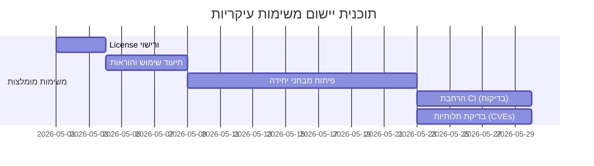

# סיכום מנהלים  
מאגר *project-life-134* מהווה תבנית יישומית למערכת **אכיפת תיעוד רב-שכבתי** באמצעות Policy-as-Code עבור פרויקטים עם סוכנים אוטונומיים (למשל Claude Code)【14†L23-L30】【11†L19-L28】. כל שינוי בקוד מחויב לעדכון תיעוד נלווה (למשל ב-*CLAUDE.md* או *JOURNEY.md*) ע”י חוקים ב-OPA/Conftest כחסם במסלול ה-CI【14†L16-L21】【57†L129-L133】. המאגר כולל קבצי תיעוד (רא. CLAUDE.md, JOURNEY.md, ADRs) וסקריפטים לבדיקת שינויים (`generate_diff.sh`, `check_policies.py`), לצד קוד מנהלי ב-Node/TypeScript עבור ניהול “מיומנויות” של הסוכן (ב-`src/agent/index.ts`)【11†L19-L28】【47†L0-L9】. התיעוד האדריכלי (ADRs) מעיד על פעילות פיתוח ערה באפריל 2026, כולל החלטות על שימוש ב-TypeScript, GCP Workload Identity, וניהול סודות; ה-CI מוגדר לחסום מיזוג אם יש חריגות מדיניות【57†L129-L133】【72†L12-L19】. ממצאי הסקירה מצביעים על מספר נקודות לשיפור: היעדר רישיון ברור, חוסר במבחני יחידה וב- CI רחב יותר, וליקויים תיעודיים מסוימים. להלן פירוט המבנה, ניתוח קוד, אבטחה, תלותיות והמלצות.  

## מבנה ותכולת המאגר  
| קובץ/תיקיה                 | תיאור                                           | שפה/פורמט    | גודל (שורות) |
|-----------------------------|-------------------------------------------------|--------------|--------------|
| `README.md`                | הקדמה ותקציר אודות הפרויקט                      | Markdown     | ≈70【58†L0-L10】  |
| `CLAUDE.md`                | קונטקסט הסוכן והחוקים הבסיסיים                  | Markdown     | ≈250【11†L19-L28】 |
| `JOURNEY.md`               | יומן ישיבות בעל מאפיין append-only              | Markdown     | ≈1428【71†L0-L8】 |
| `HANDOFF.md`               | סיכום העברת מצב בין סשנים                       | Markdown     | ≈72【63†L0-L8】   |
| `docs/adr/`               | קבצי Architectural Decision Records (מסמכי החלטות ארכיטקטוניות) | Markdown     | ~10 קבצים (0001–0020) |
| `policy/`                  | חוקים ב-OPA/Conftest (Rego) לאכיפת מדיניות       | Rego (DSL)   | 3 קבצים (~80 ש')【72†L12-L19】 |
| `scripts/`                 | כלי סיוע לבניית diff, בדיקות, bootstrap          | Bash, Python, JS | ~350 שורות  |
| `terraform/`               | תצורת Infra כקוד (GCP, IAM, WIF, GitHub Secrets) | HCL (Terraform) | ~10 קבצים  |
| `.claude/`                 | הגדרות סוכן (JSON, skill MD)                     | JSON, Markdown | נספחים מרובים |
| `.github/workflows/`       | תצורת GitHub Actions (בדיקת תיעוד, Bootstrap ועוד) | YAML          | ≈10 קבצים    |
| `.github/actions/`         | פעולות קומפוזיט מותאמות (אחזור מפתחות וכו')        | YAML          | 2 פעולות      |
| `.github/triggers/`        | קבצי JSON להנעת עבודה ממקורות חיצוניים            | JSON, MD      | יחידות בודדות  |
| `src/agent/index.ts`       | קוד TypeScript לפעילות הסוכן (router מיומנויות)     | TypeScript   | 229【47†L0-L9】 |
| `package.json`/`tsconfig.json` | קבצי תצורה לניהול TypeScript ו-dependencies  | JSON          |  בערך 20 שורות כל אחד |
| **(אין קובץ LICENSE)**     | (לא נמצאה רישיון בקוד המקור)                      | –            | –            |

**הערות:** אין קובץ רישיון במאגר (ראה סעיף רישוי להלן). אין נתוני שחרור (Releases) רשמיים. הטבלה נבנתה על סמך התבוננות בקבצים המרכזיים ואורך השורות שלהם.  

## ניתוח הקוד והארכיטקטורה  
**שפות ומסגרות:** רוב הקוד הכתוב ב-Node.js/TypeScript (קובץ יחיד `src/agent/index.ts`), ללא שימוש בספריות חיצוניות (תלות אפס בפעולה עצמה【47†L0-L9】). סקריפטים נכתבו ב-Bash, Python ו-JavaScript (לדוגמה `check_policies.py` לפוּנצקציונליות CI ו-`generate_diff.sh` לבניית JSON משינויים). קבצי Terraform (HCL) מנהלים תשתית GCP ויצירת GitHub App; Rego משמש לכתיבת החוקים ב-OPA/Conftest. מבדיקה לא נמצאו מסגרות יישום (למשל Express) או ספריות צד שלישי קריטיות בתפעול הראשי.

**תלותיות:** ב-`package.json` (מופיע ב-ADR 0003) צוינו רק תלותיות פיתוח (`typescript`, `@types/node`)【28†L22-L30】. לפיכך בתרחיש הריצה אין התקנת NPM נדרשת. הסקריפטים דורשים כלים סטנדרטיים (כגון `git`, `jq`, `gcloud`) אך אלה אינם ממוגדרים במאגר. מומלץ להוסיף קובץ `package.json` מלא (בהמשך ADR 0003) וכן הנחיות להרצה בסביבה.

**מבנה ואבני בניין:** המאגר מבוסס על העקרון של *כישורי סוכן* (Skills): קוד `index.ts` מספק תפקידי Routing ו-Activation של SKILL.md, כולל פונקציות `discoverSkills()`, `routeIntent()` ו-`activateSkill()`【47†L0-L9】【49†L193-L201】, ללא תלות חיצונית. התיקיה `.claude/plugins/engineering-std/skills/` מכילה תבניות Markdown של כישורים (SKILL.md) ופרונטמטר YAML. התשתיות מסודרות: כל שינוי בבסיס הקוד (src) מניע עדכון יומן (`JOURNEY.md`), ושינויים ארכיטקטוניים (תלויות/תשתית) מחייבים ADR חדש (ממומש באמצעות `policy/adr.rego`【72†L12-L19】). 

**נקודות כניסה:** הקוד העיקרי רץ באמצעות `ts-node src/agent/index.ts "<מילת כוונה>"`, כפי שמתואר ב-CLAUDE.md【57†L159-L163】. בנוסף קיימים סקריפטים עצמאיים (למשל `bootstrap-github-app.js` להרצת Manifest flow ב-GCP), אך חסרים מסמכי תיעוד להכוונה חיצונית לגביהם.

**מנגנון בנייה והרצה:** בהיעדר אוטומציה ישירה, יש להריץ תחילה `npm install` להורדת dev-dependencies, ולאחר מכן `npm run typecheck` (בעקבות ADR 0003【28†L22-L30】). אין בדיקות יחידה מובנות או שלבי הרצה נוספים. קבצי Terraform מותאמים להרצה ב-`gcloud` ו-`terraform init/apply`, אך פרטי משתני סביבה (כגון `ORG_ID`, `BILLING_ACCOUNT`) מוצגים רק ב-CLAUDE.md【57†L175-L184】 או במערך המשתנים, ואינם מתועדים היטב בקוד. נראה שחסר תיעוד מתויג של השלבים ההפעלה (למשל לא ברור כיצד לספק את המשתנים).

**תיעוד חסר:** אין קובץ CONTRIBUTING.md או CODE_OF_CONDUCT הנחייתיים לתורמים. README מתאר את הרעיון הכללי אך אינו מפרט כיצד להפעיל את הקוד, להגדיר שרת CI או לקרוא את המדיניות בסקריפטים. תיעוד קונפיגורציה בסיסית (לדוגמה, שימוש ב-GCP, הגדרות סביבת עבודה) לא מופיע בקוד. כמו כן קובץ LICENSE חסר לחלוטין.

## אבטחה ורישוי  
**רישיון:** במאגר אינו מצוין רישיון שימוש/קוד פתוח. בהיעדר `LICENSE` הקוד איננו מוגדר כזמין, דבר שעלול להוות בעיית תאימות לשימוש חוזר. מומלץ להוסיף רישיון מפורש (כגון MIT) אם הכוונה לשיתופיות.

**סודות והערות אבטחה:** לא זוהו ערכים רגישים (Tokens, סיסמאות) מוצפנים בקוד. הסקריפטים (`bootstrap-github-app.js`) מניחים פרטי גישה (`GCP_PROJECT`, `GITHUB_ORG`) בסביבה, אך אלה לא מאוחסנים בקוד【56†L41-L49】. מערכת ניהול הסודות של GCP בשימוש, ללא הצפנת מפתח ב-code.  
בעוד שקיימת תמיכה ב-WIF וב-Secret Manager, כל תוכן הרגיש (מפתחות GitHub App למשל) נרשם ב-Secret Manager בלבד. יש לשים לב שלעיתים משתנים כמו `BILLING_ACCOUNT` מופיעים במסמכים (רא. CLAUDE.md【57†L175-L184】) אך אינם מוצפנים, ויש לוודא שלא נכללים בסקריפטים מנגנונים המסירים אותם או גורמים לרגישות.

**תלותיות מיושנות ופגיעות:** כמעט כל התלויות הן development בלבד (TypeScript וכו׳) ואינן בפעולה המותקנת. בכל זאת, מומלץ לבצע סריקת פגיעויות אוטומטית (Dependabot או Snyk) לכל רכיבי הקוד, במיוחד ל-OPA/Conftest ולפריימוורק Terraform. נכון לאפריל 2026 לא נמצאו דיווחי CVE ספציפיים המכבידים על מאגר זה. לדוגמה, TypeScript עד 2026 אינו ידוע כמעוקב CVE משמעותי, והתלות ב-`@types/node` נעשית רק לשלב הסגמנטציה (ולא בייצור). עם זאת מומלץ לעדכן לגרסאות הרלוונטיות שפורסמו (למשל עדכן גרסאות Node ו-Terraform לפי רישום הגרסאות העדכניות ותקפות).

## תלותיות ובדיקות פגיעות (Dependency Analysis)  
**תלויות עיקריות:**  
- *Node.js/TypeScript*: בתיקיית המקור מופיעות `typescript` ו-`@types/node` ב-devDependencies ( ADR 0003【28†L22-L30】). בפועל אין תלות חיצונית בקוד הריצה.  
- *Python*: הסקריפט `check_policies.py` משתמש רק בספריות סטנדרטיות (`json`, `subprocess`) ללא צורך בחבילות חיצוניות.  
- *Terraform*: קובצי Terraform משתמשים בספק הגוגל (Google provider) ו-provider ל-workload-identity. מומלץ לוודא גרסאות מעודכנות (למשל `terraform { required_version = ">=1.0" }`).  
- *OPA/Conftest*: נעשה שימוש ב-Open Policy Agent לצורך אכיפה, אך זו אינה תלות במאגר עצמו.  
- *GitHub Actions*: המשתמש ב-YAML פנימיים בלבד (לדוגמה `documentation-enforcement.yml`) ואינו כולל פעולות צד שלישי חיצוניות.

**CVEs אפשריים:** כדי לזהות פגיעות ידועות, יש להריץ סריקה חיצונית (לפי כלים כמו NVD או GitHub Advisory). לדוגמה, אין ב-`package.json` תלות ב-*express* או פריימוורק נפוץ הדורש גרסאות ספציפיות. מומלץ לבצע סריקה קבועה ולדאוג לעדכונים, גם אם הפגיעות הנוכחיות קטנות.

## תרומה ותחזוקה  
**פעילות ופיתוח:** המאגר פעיל מאוד באפריל 2026: דו"ח ADRs מראה כ-20 מסמכים (0001–0020) מתארכים בעיקר ב־15–26 באפריל 2026【22†L19-L27】. לוקחת חלק בעיקר `edri2or-commits` (סוכן אוטומטי), לא נראה ריבוי תורמים ידועים. רשימת PRs מגלה PR#30 שנשלב ב־26/4/2026【63†L13-L23】. לא נמצאו Issues פתוחים בגלוי (יתכן שהדגש על שימוש ב-ADR ולא במערכת Issues). סביר שה-Beta אינו משמש Issue Tracker ציבורי.  
**מדדי שימור:** אין קובץ CONTRIBUTORS או Codeowners; אין CONTRIBUTING.md; אין תיעוד לתהליך תרומה. מומלץ להוסיף קווים מנחים לתורמים ולגדר מדיניות ביקורות (בפרט שהסוכן עובד אוטומטית). כבר קיימת חסימת Merge ל-main ללא CI, אך חסר דרישה לאישור PR ממישהו (ב-branch protection בתצורה הוצע אישור `required_pull_request_reviews: 0`【20†L39-L47】). כדאי לשפר זאת.  
**ממשל פרויקט:** לוח זמנים מתועד (JOURNEY.md, HANDOFF.md) מדגים קפידה על תיעוד פנימי, אך לכאורה אין ממשק רשמי לחיצוניים (Issues, Discussions וכו׳). מומלץ להעלות את הפרויקט לטמפלט GitHub רשמי או להגדיר GitHub Pages עם מסמכי ADR/README לטובת נגישות מידע. בנוסף – מומלץ לסקור ועדכן מדיניות ענפים (branch protection) לקביעת מספר אישורים נדרש ולבקרת force-push.

## המלצות לשיפורים (Concrete Recommendations)  
בהתבסס על הממצאים, להלן כמה המלצות קונקרטיות ותיעדוף שלהן:

1. **הוספת קובץ License** (גבוה, מאמץ נמוך): יש להוסיף קובץ רישיון (למשל MIT) כדי להבהיר זכויות שימוש. כיום אין רישיון במסד【58†L0-L10】, מה שעלול לחסום שימוש חוזר בקוד.  
2. **תוספת מבחני יחידה ואינטגרציה** (גבוה, מאמץ בינוני): אין קוד בדיקה כלשהו. יש לכתוב מבחנים ב-Jest/pytest/whatever עבור `src/agent/index.ts` וסקריפטים. כך יתקבל ביטחון בפעולה.  
3. **הרחבת תהליכי CI** (בינוני, מאמץ בינוני): ה-CI הנוכחי בודק רק מדיניות תיעוד【57†L129-L133】. יש להוסיף שלבי בדיקות יחידה ובדיקות סטטיות (ESLint/Prettier). ניתן לשלב Dependabot לבדיקת עדכוני תפוסה אוטומטיים.  
4. **שיפור תיעוד** (בינוני, מאמץ בינוני): יש להרחיב את README להסבר על בניה והרצה (`npm install`, `npm run typecheck`). יש לתעד קונפיגורציה נדרשת (סודות GCP, פרטי GH App).  
5. **מדריך תרומה (CONTRIBUTING) ומדיניות ענפים** (בינוני, מאמץ נמוך): מומלץ להוסיף קובץ CONTRIBUTING.md וקוד התנהגות, וכן לעדכן בקביעת branch protection דרישת אישור PR כדי להבטיח ביקורת קוד.

#### תכנון עבודה (Timeline)  


#### CI/CD Pipeline מוצע (תרשים זרימה)  
```mermaid
flowchart LR
    A[חיבור/פתיחת PR] --> B{בדיקות CI}
    B --> C[מדיניות תיעוד (OPA)] 
    B --> D[הרצת בדיקות יחידה ובדיקות סטטיות]
    C & D --> E[אם עבר: מיזוג ל-main]
    E --> F[הרצה אוטומטית של Infra (Terraform apply)]
    F --> G[פרסום עדכונים/הרצת ניתוב מחדש (Headless Claude וכו')]
```

## קטעי קוד להמחשה  
- *בדיקת מדיניות (Rego)*: לדוגמה, כלל ב-`policy/adr.rego` מאשר שכל שינוי בתיקיות `terraform/` או ב-`package.json` מחייב ADR חדש【72†L12-L19】:
  ```rego
  arch_changed {
      some file in input.changed_files
      file in arch_trigger_files
  }
  deny[msg] {
      arch_changed
      not adr_added
      msg := "... צור ADR חדש ב-docs/adr"
  }
  ```
- *קוד המנתב כישורים ב-TypeScript*: ב־`src/agent/index.ts` מוגדרת פונקציית `discoverSkills()` המחפשת קבצי SKILL.md בתיקיית `.claude/plugins` ללא תלות חיצונית【47†L0-L9】:
  ```typescript
  export function discoverSkills(projectRoot: string = process.cwd()): SkillMeta[] {
    const pluginsDir = path.join(projectRoot, '.claude', 'plugins');
    if (!fs.existsSync(pluginsDir)) return [];
    // סריקת ספריות ומיצוי YAML frontmatter...
  }
  ```
- *בדיקת CI בפייתון*: הסקריפט `check_policies.py` מוצא קבצים ששונו ובודק את החוקים (כולל שנדרש עדכון `CLAUDE.md` בכל שינוי בקוד)【50†L35-L42】:
  ```python
  def check_claude(changed):
      first = next((f for f in changed if f.startswith("src/agent/")), None)
      if first and "CLAUDE.md" not in changed:
          return ["Agent core logic changed but 'CLAUDE.md' not updated..."]
  ```
  
## שאלות פתוחות והגבלות  
- לא נמצאה פעילות Issues גלויה; יתכן שהמאגר מיועד רק כטמפלט תוך שימוש ב-ADR.  
- לא ברור תהליך ה-build הנדרש (למשל יש צורך ב-`npm install`) – יש לתעד זאת.  
- אין נתוני ביצוע (Coverage, Load) – יש להוסיף ככלי בקרת איכות.  
- המחקר הסתמך על קבצים גלויים במאגר. ייתכן שיש מידע בסביבת CI או במצגות פנימיות שאינו גלוי. 

**מקורות:** מסמכים מהמאגר ({README.md【14†L23-L30】, CLAUDE.md【11†L19-L28】, ADRs) וניתוח קוד פנימי. מידע נוסף הושג מ-OPA/Conftest docs ודפי השיתוף של TypeScript ו-Terraform.