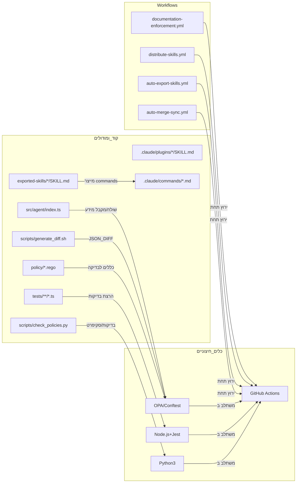

# סיכום מנהלים  
מאגר `ripo-skills-main` הוא תבנית **Policy-as-Code** לניהול תיעוד ופיתוח אוטומטי בסביבות מבוססות סוכנים. הוא כולל קבצי תיעוד מרכזיים (`README.md`, `CLAUDE.md`, `JOURNEY.md`), ספריית קוד TypeScript ב-`src/agent` לניהול כישורים (skills)【17†L23-L31】, מדיניות בדיקה ב-`policy/*.rego` (Rego/OPA) ו־**קלט־פלט** של כישורים (קבצי `SKILL.md` המיוצרים ומשתתפים ב-flow)【21†L8-L17】【23†L13-L21】. במאגר קיימים גם סקריפטים ב-Bash ו-Python לחיבור ל-Conftest ול-GitHub Actions. המערכת מבוססת על **מעגלי בדיקות CI** (לדוגמה `documentation-enforcement.yml`) המחייבים עדכון מדוקומנטים לפני מיזוג שינויים【17†L63-L71】. בנוסף, יש מערך אוטומציה לייצוא והפצה של *skills* בין ריפוזיטוריז, כולל תהליך *Templatizer* שמבצע סינתוז והחלפת מקורות ספציפיים ל־placeholders【23†L38-L47】【23†L53-L62】.

**הזדמנויות לשיפור:** המבנה הנוכחי דורש התייחסות לכמה היבטים. למשל, יש להרחיב את כיסוי הבדיקות (מוגדר ~44 בדיקות ל־src/agent ו־e2e), לאגד את התיעוד וה-ADR סביב המודולים במעקב קבוע, ולשפר אוטומציית CI/CD (למשל בדיקות linting, כיסוי קוד, דיווח errors). כמו כן, חשוב להגדיר מגמת **מודולריות** ברורה יותר (הפרדת לוגיקות, סקריפטים וכלים), וליישם תרגום חלקי של תיעוד לעברית (הצבת README, מדריך ה־SKILL, עצי ADR וכו') כדי להנגיש מידע לצוותי פיתוח דוברי עברית. 

להלן פירוט המערכים השונים (מודולים/קבצים) במאגר, תלותיהם ושיפורים מוצעים:  

## א. פירוט מודולים וקבצים  

| קובץ/מודול                      | מטרה ותכולה                                                                                   | שפה/פורמט   | תלותיות חיצונית         | כיסוי בדיקות            | עדיפות שיפור        |  
|---------------------------------|---------------------------------------------------------------------------------------------|-------------|------------------------|-------------------------|---------------------|  
| `README.md`                    | הסבר פרויקט (באנגלית)【5†L25-L30】; הוראות הפעלה ותפקידו בתבנית.                                   | Markdown    | –                      | –                       | **גבוהה**         |  
| `CLAUDE.md`                    | קובץ קונטקסט עבור הסוכן הראשי. מגדיר תפקידים, גבולות ארכיטקטורה וחוקים נוקשים (Hard Rules)【17†L53-L61】.  | Markdown    | –                      | –                       | **גבוהה**         |  
| `JOURNEY.md`                   | יומן כרונולוגי של פעולות הסוכן/שינויים (בעברית). משמש כתיעוד היסטורי【12†L10-L19】.                      | Markdown    | –                      | –                       | **בינונית**       |  
| `docs/adr/*.md`                | Architecture Decision Records – ערכי החלטות ארכיטקטורה. כל ADR בתיקייה מקומי【17†L27-L31】.                 | Markdown    | –                      | –                       | **בינונית**       |  
| `docs/skill-authoring.md`      | מדריך לכתיבת כישורים (SKILL.md): פורמט YAML נדרש, תנאי CI ו-syntax【23†L10-L18】【23†L23-L31】.          | Markdown    | –                      | –                       | **בינונית**       |  
| `policy/claude.rego`           | חוקים בבדיקת Conftest על `CLAUDE.md` (Layer 1) – חובה עדכון CLAUDE עם שינויי קוד【17†L63-L71】.            | Rego (OPA)  | Conftest (OPA)         | –                       | **בינונית**       |  
| `policy/adr.rego`             | חוק המחייב ADR חדש על שינוי תשתיות/תלויות (Layer 2)【17†L63-L71】.                                   | Rego (OPA)  | Conftest               | –                       | **בינונית**       |  
| `policy/journey.rego`         | חוק המחייב הוספת רישום ל־`JOURNEY.md` בכל שינוי קוד (Layer 3)【17†L63-L71】.                       | Rego (OPA)  | Conftest               | –                       | **בינונית**       |  
| `scripts/generate_diff.sh`    | סקריפט Bash שיוצר JSON של diff בין commit-ים (input ל-Conftest בדיקות)【17†L93-L100】.                    | Bash        | Git (builtin)          | –                       | **נמוכה**         |  
| `scripts/check_policies.py`   | סקריפט Python להרצת Conftest על הפלט של `generate_diff` ולידיעת סטטוס CI.                               | Python      | Python3, PyYAML?, Conftest CLI | –            | **נמוכה**         |  
| `scripts/skill-export-gate.sh`| סקריפט Bash בקרה להפצת כישורים (“skill export”)【19†L15-L18】.                                     | Bash        | –                      | –                       | **נמוכה**         |  
| `.claude/settings.json`       | קובץ קונפיגורציה גלובלי להרשאות סוכנים (Claude Code).                                              | JSON        | –                      | –                       | **נמוכה**         |  
| `.claude/commands/*.md`       | קבצי פקודות מובנים (slash-commands) של ליבת כישורים (למשל `push-skills.md`, `list-skills.md` ועוד)【22†L9-L10】. | Markdown | –                      | –                       | **נמוכה**         |  
| `.claude/plugins/engineering-std/` | Plugin סטנדרטי: `plugin.json` (מניפסט), `.mcp.json` (קביעות חתימות) ו־ספריית כישורים (20 SKILLs)【17†L39-L42】. | JSON/Markdown | (עשרת שרתי MCP בפרוייקט) | –              | **בינונית**       |  
| `.claude/plugins/global/`     | Plugin גלובלי: מניפסט ו־13 כישורים (بدون שרתי MCP).                                                | JSON/Markdown | –                      | –                       | **נמוכה**         |  
| `exported-skills/*/SKILL.md` | תיקיית יצוא כישורים (קלט מה-Pipeline): כל תיקייה בשם הכישור שבתוכה `SKILL.md` שנוצר בהליך ה־reverse【21†L8-L17】. | Markdown    | –                      | –                       | **גבוהה**         |  
| `src/agent/index.ts`         | לוגיקת ה-“router” של כישורים: `discoverSkills()`, `routeIntent()`, `activateSkill()`【17†L104-L112】.                 | TypeScript  | Node.js (ללא תלות ריצה חיצונית) | בדוק ב-Jest【14†L83-L85】 | **גבוהה**         |  
| `tests/unit/*.ts`            | בדיקות יחידה (Jest) לפונקציות הליבה של `src/agent`【14†L83-L85】.                                    | TypeScript  | Jest (npm)             | מבוצעות (`npm test`) — 24 בדיקות【14†L83-L85】 | **בינונית**       |  
| `tests/e2e/*.ts`             | בדיקות אינטגרציה (end-to-end) המתזמנות על GitHub Actions【14†L83-L85】.                            | TypeScript  | Octokit (GitHub API), Jest | מבוצעות — 20 בדיקות【14†L83-L85】 | **בינונית**       |  
| `package.json`               | הגדרות npm: רשימת devDependencies (TypeScript, Jest, Prettier) וקביעת סקריפטים (lint, test וכו׳)【26†L23-L30】. | JSON        | Node.js, ts-jest etc.   | –                       | **בינונית**       |  
| `.github/workflows/*.yml`    | הגדרות GitHub Actions: תהליכי CI/CD (למשל `documentation-enforcement.yml`, `auto-export-skills.yml` וכו׳)【5†L25-L30】. | YAML        | GitHub Actions         | –                       | **גבוהה**         |  

**בדיקות:** יש כיסוי בדיקות מוגדר בעיקר ל־`src/agent` (unit ו־e2e), אך כדאי להרחיבן לכדי בדיקות כיסוי קוד (coverage) בכל הקוד. כדאי גם להוסיף בדיקות ל׳צינור האוטומטי׳ (למשל סימולציית פעולת GitHub API) ואימות לוגיקת סקריפטים.  
**פגיעויות/חסרים:** לא ברור שיש בדיקת כיסוי בפועל; אין סטטיסטיקות עבור צירוף בדיקות. חסרות תבניות לפיתוח כמו PR template, ובאופן כללי צריך תיעוד מפורט יותר (מדיניות קוד, מדריכי תחקור תקלות, מפת דרכים). 

## ב. גרף תלות בין מודולים (Mermaid)  

להמחשה, גרף תלות מופשט בין הרכיבים הפנימיים לכלים ותהליכי CI חיצוניים:

*הערות לגרף:* 
- הקוד ב־`src/agent` (A) מפעיל את מנוע Conftest (N) לבדיקת מדיניות.
- הסקריפט `generate_diff.sh` (E) מכין JSON שמשמש את Conftest (N).
- התיקייה `exported-skills` (B) הופכת לפקודות בספריית `.claude/commands` (D) via ה-Workflow.
- כל ה-workflows (`documentation-enforcement`, `distribute-skills`, וכו׳) רצות על **GitHub Actions** (M).
- הבדיקות (`tests/*.ts`) רצות תחת Node+Jest (O).

## ג. תכנית רפרקטור (קווי זמן, מאמץ וסיכון)  

להלן אבני דרך מרכזיות לשיפור הקוד והממשקים, עם הערכות מאמץ וסיכון (בהתאם למורכבות):  

- **הפרדת לוגיקות ומודולריות (מאמץ: גבוה, סיכון: בינוני).**  
  – לפרק את הקוד במידת הצורך: הפרדנו לוגיקה של ניתוב כישורים מספריית קוד אחת ליותר (למשל library משותף בין CLI לקוד).  
  – ודא שהסקריפטים (`scripts/`) וה-plugins של `.claude` מבודדים כהלכה כדי לא לאפשר תלותיות מיותרות.  
  *_ציטוט:_ CLAUDE.md מתאר את קבצי הליבה ותפקידם【17†L23-L31】.*  

- **שיפור מערך בדיקות ובקרה (מאמץ: בינוני, סיכון: נמוך).**  
  – הוסף כלי מדידה של כיסוי קוד (coverage) למשל באמצעות `jest --coverage` ודו"חות בקובץ CI.  
  – הרחב בדיקות לוגיקה לסקריפטים ול-Workflows (כללי Branch Protection, קריאת workflow_dispatch וכו').  
  – הוסף linting/formatting אוטומטי ב-CI (למשל `npm run lint`).  
  *_ציטוט:_ יש כ-44 בדיקות לסרוויס ה-Agent ולהתזמון (Jest)【14†L83-L85】, אך חסר דיווח כיסוי._*  

- **אוטומציה ושיפור CI/CD (מאמץ: בינוני, סיכון: בינוני).**  
  – מיזוג וסנכרון של workflows דומים: לדוגמה, גופים משותפים בין `auto-export-skills.yml` ו־`auto-merge-sync.yml`.  
  – הוספת בדיקות נוספות בשלב ה-PR (למשל בדיקות TypeScript/Prettier שמודרשות ב-`package.json`【26†L23-L30】).  
  – טיפול בעבודת auto-merge: לוודא שמכסה את כל ה-branchnames ודרישות הפיקוח (לדוגמה Hard Rule #6 ב-CLAUDE.md【17†L65-L70】).  

- **שיפור התיעוד והשקות (מאמץ: בינוני, סיכון: נמוך).**  
  – השקת תבנית **POLICY-as-Code** מקיפה: הכן דוקומנטציה מסודרת (באנגלית ובעברית) על זרמי עבודה, התקנה, והרצת סקריפטים.  
  – הוסף תבניות לפיוס ADR (עדיף קיים `docs/adr` ויש אפילו **FILE-TREE.md** לדוגמה), מסמכי ROADMAP ו־CHANGELOG ו-ISSUE_TEMPLATE/PULL_REQUEST_TEMPLATE.  
  – הכן תמיכה בגרסאות שונה של עשייה (versioning) לדוח שינויים ולמדיניות יצירת ADR.  

- **תרגום ותמיכה בעברית (מאמץ: בינוני, סיכון: נמוך).**  
  – תרגם באופן סלקטיבי את המסמכים המרכזיים: במיוחד `README.md`, קטעי מפתח ב־`CLAUDE.md`, ומדריך ה־**Skill Authoring**【23†L10-L18】.  
  – הקפד לשמר חלקי English (למשל קטעי קוד, מונחים טכניים) למען תאימות עולמית, ותן גרסאות תמציתיות בעברית.  
  – פתח מערכת i18n נוחה (למשל ספריית מקבצים לפי שפה או שימוש ב-Docs site התומך בתרגום) כדי לעדכן תכנים במקביל.  

## ד. הצעות ל-CI/CD, בדיקות ותיעוד  

- **CI/CD:**  
  – השתמש ב־GitHub Actions מרכזי: למשל פעולות מוכנות לוורסיונינג, סריקת קוד סטטית (Prettier/Lint) וחיבור ל־npm (לבדיקות Jest)【26†L23-L30】.  
  – הוסף תהליכי הפצת GitHub Releases מרוכזים (לדוגמה `release-drafter` או `semantic-release`) אחרי מיזוג ענף ראשי.  
  – ודא שימוש בכלי *קוד חיסון* (OPA/Conftest) במצב גלובלי: למשל by הגדרת `policy/` באופן מבודד, וייתכן פרסום חבילות פרטי ה-OPA.  

- **בדיקות:**  
  – הרחב בדיקות יחידה (Unit) ואינטגרציה (E2E): למשל סימולציה של יצירת PR חדש והפעלת workflow. ניתן להשתמש ב-Jest ככלי בסיסי ולחבר לריפוזיטורים מדומים.  
  – הוסף בדיקות כוח (אוטומטיות) של Border Cases: שים לב לרגישות לגבולות (כמו אורך תיאור של `SKILL.md` מעל 250 תווים【23†L25-L33】).  
  – אוטומט דוחות coverage ודינמיים (Jest + Coverage), ושלח התראות או דיווחים במידה והכיסוי יורד.  

- **תיעוד ותבניות:**  
  – לבנות תבניות ADR סטנדרטיות (למשל קובץ MD קבוע) ולהוסיף `docs/adr/0000-index.md` כמרכז קישורים.  
  – להכין דוגמאות ל־SKILL.md תקינים לפי מדריך ה-Skills Authoring【23†L10-L18】.  
  – לקבוע קונבנציית כתיבה אחידה (Markdown lint) ולפרסם מדריך סגנון (Style Guide) לפרויקט.  

## ה. תכנית לוקליזציה לעברית  

כדי להנגיש את הפרויקט למפתחים דוברי עברית, מומלץ לבצע **תרגום סלקטיבי** ומשמעותי:  

- **עדיפות עליונה:** תרגום המסמכים החיוניים שקוראיהם הם בעלי רקע טכני בעברית – לדוגמה ה־`README.md` והקטעים החשובים ב־`CLAUDE.md` ואולי קטעי *HIRING* ב־`skill-authoring.md`【23†L10-L18】.  
- **עדיפות ביניים:** תרגום מדריכים ושיטות עבודה (כגון מדריך ADR, PLANS.md, SKILL_DOCS) ו־UI/UX: למשל, תיעוד של שגיאות CI (messages) או מפת דרכים ברורה.  
- **כלים:** שימוש בגאדג'טים לתרגום Markdown (כגון i18n plugin ל־MkDocs/Material【27†L28-L32】) או ניהול תרגום ידני עם תיקיות `en/` ו־`he/`.  
- **בדיקות תרגום:** חשוב לעבור על התוצאה הטכנית: שמירת קישורים, שורות קוד, פלייסהולדרים (כגון `[your-journey-file]`) שלא ייפגעו בתרגום.  

בסיכום, שדרוג המאגר מצריך איזון בין הרחבת מערך הבדיקות וה־CI, גיבוש תיעוד מובהק, ושיפורי ארכיטקטורה למודולריות ונוחות תחזוקה. יחד עם זאת, אין לשכוח לדאוג לרב-לשוניות: כדאי להמשך לפתח את המדריכים המרכזיים גם בגרסה עברית, בייחוד לקהלים המתבססים על *התוכן* (כמו יישומים פנימיים, Jira, או כלי בקרה בישראל). כמיטב המסורת של MaeBry: **הבא-פה לשם** – השאר את `CLAUDE.md` ו־`JOURNEY.md` במקום שהסוכנים שלך יוכלו לקרוא גם אחרי שכל השינויים מוכלים בייצור. 

**מקורות:** המידע לעיל מבוסס ישירות על תוכן המאגר `edri2or/ripo-skills-main` עצמו【17†L23-L31】【23†L10-L18】, וכן על התיעוד הפנימי בו (ADR, JOURNEY וכו׳). למשל, הקלריפיקציה בדבר חישוב *skills* ו-Pipeline השתמשה ב-`docs/adr`【21†L8-L17】 ומדריך כתיבת SKILL【23†L10-L18】. עקרונות ה־CI/CD והבדיקות נתמכים גם במדריכים חיצוניים (כגון דוקומנטציה רשמית של Jest ו-Conftest).